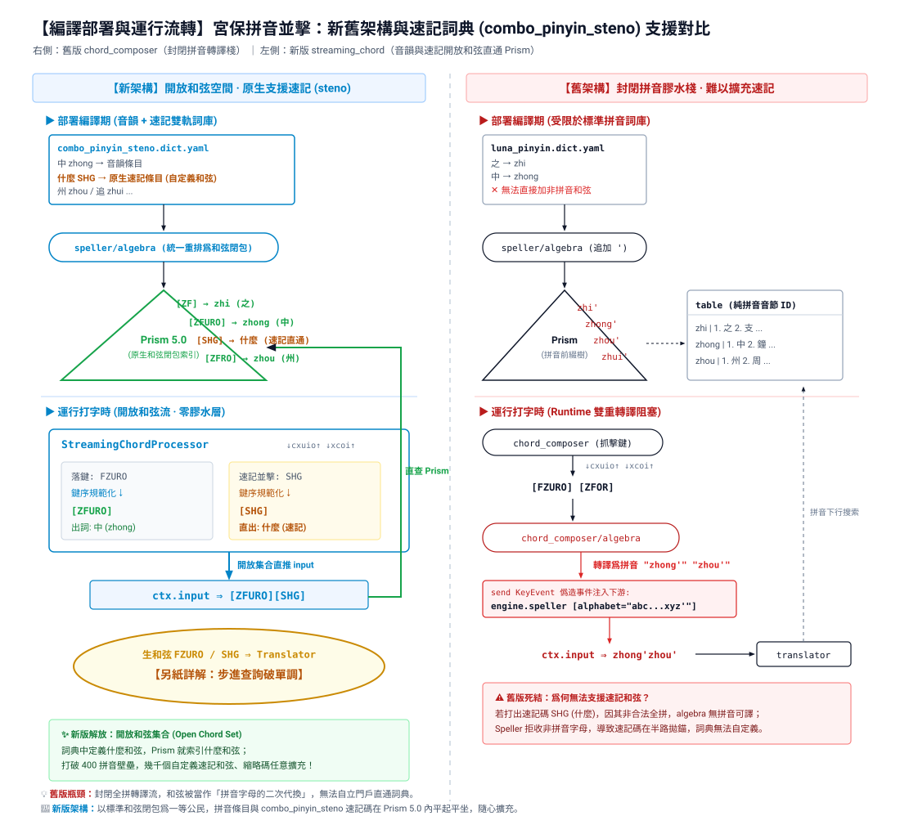
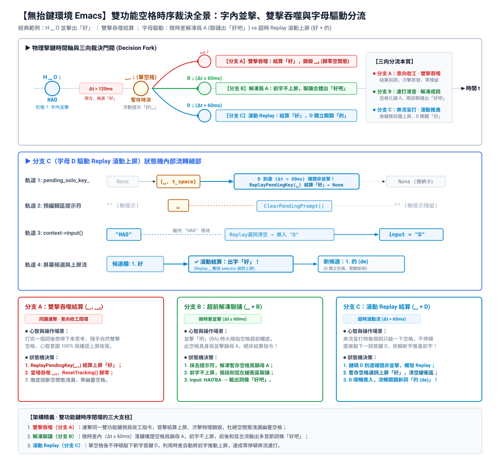
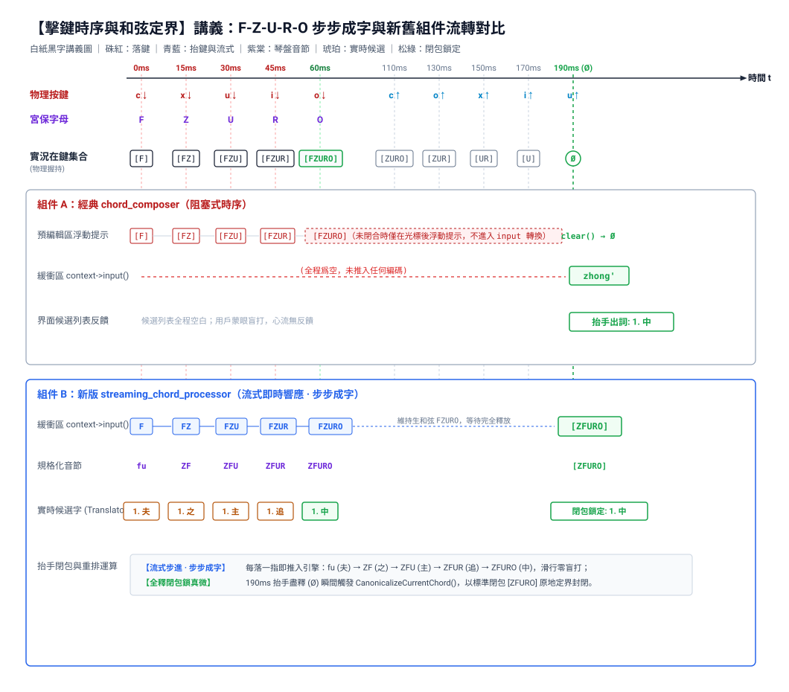
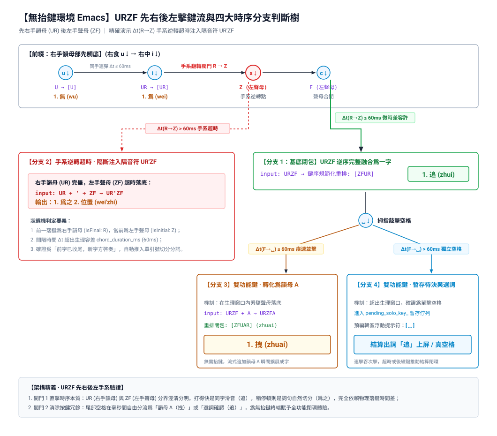
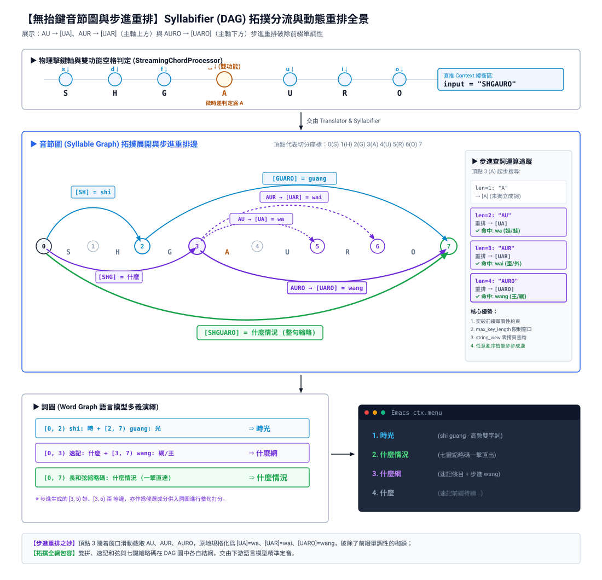

# 【九張機·宮保並擊重構經緯】

機杼聲聲穿夜永，九番翻轉見經綸。

君以梭機作琴盤，借代碼織錦繡。自底層時序算起，經編譯計算、棱鏡索引，直貫西文穿流與動作後綴，整套工程機關環環相扣。

此「九張機」全壁，正合宮保並擊重構之精魄：

## 序章·全局架構藍圖：從拼音膠水棧到開放和弦空間

在傳統並擊設計中，和弦往往被視作「全拼字母的二次轉譯」，架構受限於拼音音節的封閉集合；
新架構將標準和弦確立爲底層並擊詞典的一等公民，實現了詞典編譯與引擎查詢直通。

## 一張機，免除異步定時器

> 線程退散波瀾斂，落鍵流翻結舊詩。
> 莫向後台尋造化，新聲叩處是歸期。

* **機關密鑰**：`StreamingChordProcessor` 徹底摒棄後台計時線程（No Timer Thread），全靠輸入流中新落鍵的物理時間戳（tₙ - tₙ₋₁）前置推動舊音節結算。事件不來，狀態機如枯木止水；事件一至，毫秒級定音。

## 二張機，雙手微差相位移

> 右先左後容差在，規範重排莫道遲。
> 莫因毫釐疑逆轉，和弦歸位正當時。

* **機關密鑰**：針對人體生理「右手韻母偶早於左手聲母數毫秒觸底」（如先 A 後 S，Δt ≤ 60 ms）之常態，攔截誤判，不妄加隔音符，順暢送入重排器規範化爲正序，化解逆向交錯擊鍵。

## 三張機，緩衝區同步重置

> 空囊一洗前痕盡，退步抽身指針齊。
> 抹去浮華歸太極，再敲無復隔音迷。

* **機關密鑰**：退格（BackSpace）、回車或 Escape 致使 `input` 爲空時，`ResetTracking()` 主動將最後按鍵指針歸零，根治了退格後重打第一字被誤判定爲「手系逆轉」而誤加分隔符的頑疾。

## 四張機，雙功鍵位廣充滋

> 空格分號皆入律，連擊吞吐各成蹊。
> 待決浮標分明在，指尖輕按引靈犀。

* **機關密鑰**（Commit `899089a` & `14f14cb`）：雙功能鍵自空格泛化至分號、標點等非字母字符（`dual_role_keys_`）。
* 孤立敲擊落鍵即暫存，浮窗可見 `[;]` 或 `␣`；
* 手指一抬即時結算原生標點或選詞；
* 連擊（Double Tap）結算首鍵、吞掉重複鍵；
* 微時差內雙雙功能鍵並擊（如空格+分號）自動解凍融合，無縫銜接。

* **極限邊界：雙功能空格延時與補償重發**：
  面對「空格身兼選詞與韻母 A」的雙重身份，狀態機透過暫存提示「␣」與非雙擊超時重發，實現零失誤分流。

  

## 五張機，全釋閉包鎖真微

> 抬手自然音節斷，串流物理合符規。
> 桌面平臺收放穩，終端連奏亦神奇。

* **機關密鑰**（Commit `74db0d1` & `3381859`）：雙軌自適應。

* **桌面 GUI 環境時序基準（有 KeyUp）**：
  在具備按鍵釋放事件的環境中，手指全釋放（Ø）即觸發閉包規範化，連打絕不注入多餘分隔符。

  

* **無抬鍵環境流控閥門（無 KeyUp，如 Emacs）**：
  在無法依賴抬鍵的終端中，狀態機單憑落鍵時間差（Δt）與聲韻手系翻轉精確裁決，在並擊邊界推入 `'` 隔音符。

  

## 六張機，重排算子理亂絲

> 去重順序乾坤定，莫教正則費心機。
> 宮保鍵序琴盤列，字字周正不差池。

* **機關密鑰**（Commit `f382675`）：Calculus 引擎新增 `reorder <order> [dedup]` 核心算子。
* 不管是聲母倒錯（`FZ` → `ZF`）、全和弦亂序（`FZURO` → `ZFURO`），抑或是雙手交錯（`UZRF` → `ZFUR`），一律依宮保琴盤鍵序歸位；
* 支持開啓 `dedup` 消除抖動重複鍵；非鍵序字元（標點、隔音符）作爲原生邊界安全隔離。

## 七張機，棱鏡步進破單調

> 鍵長五代標極值，步進精查替代窮。
> 莫道前綴難下溯，毫芒析出見真容。

* **機關密鑰**（Commit `89b2fbd`, `7beb718` & `4c942d5`）：重排規則打破了字符串的前綴單調性，使傳統 Trie 的下行前綴搜索（`CommonPrefixSearch`）失效。
* **Prism 5.0**：存儲結構升級，元數據增加 `max_key_length`，支持 `std::string_view` 無拷貝查詢；
* **Syllabifier 步進查詢**：在 `max_key_length` 窗口內，逐位截取子串經 `canonicalizer_` 規格化，呼叫 `prism.GetValue` 做精確比對。演算法優雅簡練，從根本上解決了並擊和弦長詞圖切分問題。

* **Syllabifier 音節圖 (DAG) 拓撲展開與步進重排**：
  子串原地規格化打破了前綴單調性，步進精確查詢取代下行前綴搜索，容許雙拼、速記和弦與長縮略碼在圖論中優雅共生。

  

## 八張機，和弦後綴挾雷霆

> 指底同敲出動作，抽絲剝繭自通靈。
> 迅捷何須分兩步，翻飛落處已昇平。

* **機關密鑰**（Commit `662761f`）：動作和弦機制（`streaming_chord/actions`）。
* 規範化和弦結算時，`PopAction` 精確剝離尾部動作後綴（如並擊空格確認選詞上屏）；
* 核心先將純淨編碼推入緩衝區，緊接着重新發射原生按鍵動作（`engine_->ProcessSyntheticKey(action)`），一鍵完成「擊弦」與「定字上屏」，免去二次確認。

## 九張機，西文記賬客不欺

> 實體分軌存真本，錦屏翻轉兩相宜。
> 翻頁尋真終點客，穿流而過不留泥。

* **機關密鑰**（Commit `74bd5dc` & `1809d07`）：
* **AsciiComposer 實體分軌**：維護底層 `raw_keys_` 物理按鍵總賬；大寫字母（`inline_uppercase`）與小鍵盤數字（`inline_keypad`）即時切入臨時西文；`TransitInlineAscii` 隨時保存與還原中文和弦快照，配合 `commit_raw_input` 直出實體字符，中西穿梭毫無掛礙；
* **KeyBinder 點號網址重釋**：翻頁鍵遇單次點號 `.` 且後接字母時，自動補償重釋爲網址點，杜絕打網址時被翻頁功能吞噬。
